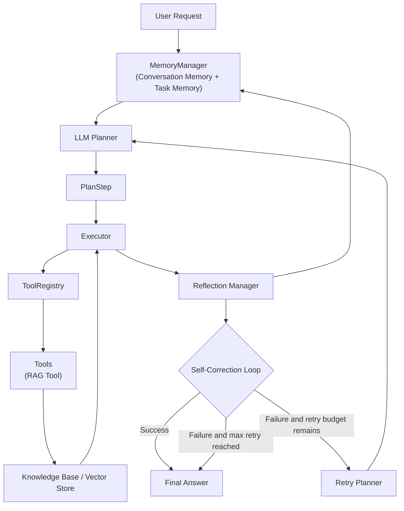

# Personal AI Agent

A local-first AI assistant with document knowledge base, RAG question answering, tool calling, planning, memory, reflection, self-correction, and report generation.

## Features

- Document Parsing: PDF, DOCX, TXT, and Markdown ingestion
- RAG Retrieval: chunking, embedding, vector search, and cited answers
- Tool Calling: extensible `ToolRegistry` with pluggable Agent tools
- LLM Planning: structured plans generated from available tools
- Agent Execution: executes `PlanStep` tool calls and summarizes results
- Conversation Memory: stores recent Agent conversation turns
- Task Memory: records task state, tool results, retry count, and reflection history
- Reflection Evaluation: evaluates answer quality and execution health
- Self Correction Retry: bounded retry loop when reflection fails
- Reports: Markdown and PDF report generation
- Web UI: Vue 3 workspace for chat, uploads, history, and reports

## Agent Architecture



## Tech Stack

- Backend: Python 3.11+, FastAPI, SQLAlchemy, SQLite
- AI: OpenAI-compatible chat API with local fallback
- RAG: deterministic local embeddings, ChromaDB optional, JSON vector fallback
- Documents: pypdf, python-docx
- Reports: Markdown, reportlab PDF
- Frontend: Vue 3, Vite, TypeScript, Axios

## Project Structure

```text
backend/app
+-- api              FastAPI routes
+-- agent            planner, executor, tool registry, self-correction
+-- core             config, database, exceptions
+-- memory           conversation memory, task memory, memory manager
+-- models           SQLAlchemy models
+-- parsers          PDF, Word, Markdown, TXT parsers
+-- prompts          RAG prompt templates
+-- reflection       evaluator and reflection manager
+-- schemas          Pydantic request/response models
+-- services         business workflows
+-- utils            text splitting and citation helpers
`-- vectorstore      Chroma adapter and JSON fallback store
```

## Core Workflows

### Knowledge Base

```text
Upload document
-> DocumentService parses and chunks text
-> EmbeddingService creates vectors
-> Vector store indexes chunks
-> RAGService retrieves relevant sources
-> LLMService generates cited answers
```

### Agent

```text
User task
-> Memory context
-> LLM Planner creates structured PlanSteps
-> Executor calls tools through ToolRegistry
-> Reflection evaluates the answer
-> Self-Correction retries when needed
-> Task and conversation memory are saved
-> Final answer is returned
```

## Quick Start

### Backend

```bash
cd personal-ai-agent/backend
python -m venv .venv
.venv\Scripts\activate
pip install -r requirements.txt
copy .env.example .env
uvicorn app.main:app --reload
```

API docs: `http://localhost:8000/docs`

To use a real LLM, edit `backend/.env`:

```env
LLM_API_KEY=your_api_key
LLM_BASE_URL=https://api.openai.com/v1
LLM_MODEL=gpt-4o-mini
```

ChromaDB is optional. The app falls back to a local JSON vector store when ChromaDB is unavailable:

```bash
pip install -r requirements-vector.txt
```

### Frontend

```bash
cd personal-ai-agent/frontend
npm install
npm run dev
```

Frontend URL: `http://localhost:5173`

## Tests

```bash
cd personal-ai-agent/backend
python -m pytest
```

Current backend test suite covers document parsing, RAG, LLM service fallback, tool registry, planner, executor, memory, reflection, and self-correction.
